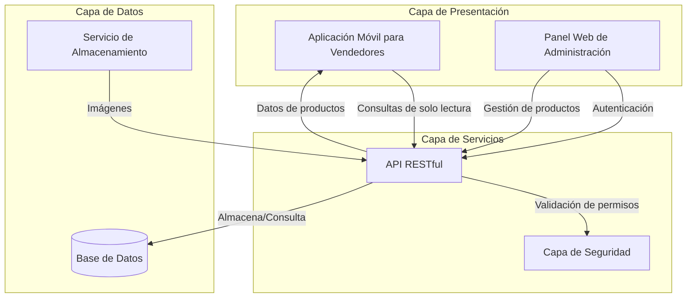

# Proyecto Interlimpia
# Documento de Especificación de Pruebas
Versión 1.0
Fecha: 03/04/2025
Preparado para Interlimpia S.A.

## Historial de Revisiones

| Fecha | Descripción | Autor | Comentarios |
|-------|------------|-------|------------|
| 03/04/2025 | Versión 1.0 | F. Caballero, P. Mirazo, F. Lucero, J. Verdini | Borrador Inicial |

## Aprobación del Documento

La siguiente Especificación de Pruebas ha sido aceptada y aprobada por los siguientes:

| Nombre | Cargo | Fecha |
|--------|-------|-------|
| P. Mirazo | Desarrollador | |
| Ing. Mario Cuevas | Scrum Master | |
| F. Lucero | Desarrollador y Responsable de Pruebas | |
| J. Verdini | Tester y Desarrollador | |
| F. Caballero | QA y Desarrollador | |

## 1. Introducción

### 1.1 Propósito

El propósito de este documento es definir los requerimientos de prueba para la aplicación móvil Interlimpia que será desarrollada para Interlimpia S.A., distribuidora de artículos de limpieza que opera en la Región de Cuyo, Argentina. Este documento será utilizado por todos los interesados en el proyecto, incluyendo el equipo de desarrollo (P. Mirazo, F. Caballero, F. Lucero, J. Verdini) y el equipo de pruebas (F. Caballero como QA y Desarrollador, J. Verdini como Tester y Desarrollador, F. Lucero) bajo la supervisión del Scrum Master (Ing. Mario Cuevas).

### 1.2 Alcance de las Pruebas

#### En Alcance (In Scope):

- **FUNCIONALIDAD:** Se probará toda la funcionalidad relacionada con la consulta de precios, sincronización de datos y visualización de productos. Esto incluye búsquedas por código, por descripción y por marca.
- **USABILIDAD:** Se probará la facilidad de uso de la aplicación, considerando que debe ser intuitiva para usuarios con conocimientos tecnológicos muy básicos, sin necesidad de capacitación previa.
- **COMPATIBILIDAD:** Se verificará la compatibilidad con dispositivos Android 10+ e iOS 10+.
- **UI:** Se probarán todos los elementos de la interfaz de usuario, verificando que cumplen con los requisitos de diseño (paleta de colores sobria similar a Mercado Libre) y son fáciles de entender.

#### Fuera de Alcance (Out of Scope):

- **PERFORMANCE:** No se realizarán pruebas exhaustivas de rendimiento, aunque se verificará que las búsquedas respondan en tiempos menores a 3 segundos.
- **HARDWARE:** No se realizarán pruebas específicas de hardware más allá de la compatibilidad básica con dispositivos móviles.
- **PRUEBAS AUTOMATIZADAS:** No están dentro del alcance para esta fase del proyecto.
- **SEGURIDAD:** No se realizarán pruebas específicas de seguridad ya que la aplicación no maneja datos sensibles y operará de forma pública.
- **PRUEBAS DE FUNCIONALIDAD FUTURA:** La funcionalidad para gestión de pedidos que se implementará en el futuro no será parte de estas pruebas.

### a 1.3 Definiciones, Acrónimos y Abreviaturas

| Abreviatura | Palabra |
|-------------|---------|
| ADM | Administrador |
| VEN | Vendedor/Transportista |

## 2. Requerimientos Específicos

La aplicación Interlimpia tendrá 2 roles principales:

1. Administrador (Gerente de Ventas)
2. Vendedor/Transportista (Acceso público)

### 2.1 Descripción de Roles

| Rol | Descripción |
|-----|-------------|
| Administrador | Responsable de actualizar las listas de precios en el sistema. Único usuario con acceso de escritura en el sistema. El encargado de ventas (gerente) tendrá este rol. |
| Vendedor/Transportista | Usuario final que consulta los precios de los productos a través de la aplicación móvil. Tendrán acceso público de solo lectura a la información de precios. |

### 2.2 Features por Rol

| Módulo | Roles Aplicables | Descripción |
|--------|------------------|-------------|
| Consulta de Precios | ADM, VEN | Permite buscar y visualizar los precios actualizados de los productos. Los vendedores podrán realizar búsquedas por código, por descripción (parcial) o por marca. |
| Actualización de Listas | ADM | Permite importar y normalizar las listas de precios desde archivos Excel de los cuatro proveedores (Rey de la limpieza, Mr. Clean, Olimpia, Limpiq). |
| Gestión de Imágenes | ADM | Permite subir, modificar y eliminar imágenes de productos que serán mostradas en la aplicación. |
| Visualización de Producto | ADM, VEN | Muestra la información completa del producto (código interno, marca, descripción, precio de venta e imagen). |
| Categorización de Productos | ADM, VEN | Permite categorizar y filtrar productos por tipo (limpieza del hogar, limpieza industrial). |

### 2.3 User Stories

#### US-01: Búsqueda de productos por código

**Como** vendedor de Interlimpia  
**Quiero** poder buscar productos por su código interno  
**Para** encontrar rápidamente la información actualizada de precios que necesito mostrar a los clientes  

**Criterios de aceptación:**
- El sistema debe permitir ingresar el código interno del producto  
- Al realizar la búsqueda, debe mostrar la información completa del producto:
  - Código  
  - Marca  
  - Descripción  
  - Precio  
  - Imagen  
- Si el código no existe, debe mostrar un mensaje indicando que no se encontraron resultados  
- El tiempo de respuesta debe ser menor a 3 segundos

#### US-02: Actualización de listas de precios

**Como** administrador del sistema  
**Quiero** poder importar y actualizar las listas de precios desde archivos Excel de los proveedores  
**Para** mantener la información de precios actualizada para los vendedores  

**Criterios de aceptación:**
- El sistema debe permitir seleccionar un archivo Excel para importar
- Debe permitir seleccionar el proveedor al que corresponde la lista (Rey de la limpieza, Mr. Clean, Olimpia, Limpiq)
- Debe mostrar una vista previa de los datos antes de confirmar la actualización
- Al confirmar, debe actualizar los precios en el sistema
- Si el formato del archivo no es compatible, debe mostrar un mensaje de error

#### US-03: Subir imagen para un producto existente

**Como** administrador del sistema  
**Quiero** poder subir una imagen para un producto existente  
**Para** que los clientes puedan visualizar el producto en el catálogo

**Criterios de Aceptación:**
1. Acceso desde la sección **"Gestión de Imágenes"**.
2. Búsqueda de productos por **código interno** (ej: `B456`).
3. Soporte para imágenes en formato **JPG/PNG** (<2MB).
4. **Vista previa** de la imagen antes de guardar.
5. **Confirmación** visual al guardar exitosamente.
6. La imagen debe **asociarse persistentemente** al producto.

**Escenarios:**

*Escenario 1: Subida exitosa*  
**Dado** que soy un administrador logueado  
**Y** existe el producto con código `B456`  
**Cuando** subo una imagen válida (<2MB, JPG/PNG)  
**Y** confirmo la operación  
**Entonces** el sistema:
- Guarda la imagen  
- Muestra mensaje: _"Imagen asociada correctamente"_  
- Asocia la imagen al producto en consultas posteriores

*Escenario 2: Imagen con tamaño excedido*  
**Dado** que soy un administrador logueado  
**Cuando** intento subir una imagen >2MB  
**Entonces** el sistema:
- Muestra error: _"El tamaño máximo es 2MB"_  
- Cancela el proceso de subida  
- Mantiene el formulario editable

*Escenario 3: Producto no encontrado*  
**Dado** que soy un administrador logueado  
**Cuando** ingreso un código inexistente (ej: `XXX999`)  
**Entonces** el sistema muestra: _"Producto no encontrado"_

**Metadata:**
| Campo | Valor |
|-------------|-----------------|
| **Prioridad** | Media (🟡) |
| **Estimación** | 3 story points |
| **Epic** | Gestión de Catálogo |
| **Dependencias** | US-01 (Alta de productos) |

#### US-04: Filtrado de productos por categoría

**Como** vendedor de Interlimpia  
**Quiero** poder filtrar productos por su categoría (limpieza del hogar o industrial)  
**Para** encontrar más fácilmente los productos que necesito según el tipo de cliente

**Criterios de aceptación:**
- El sistema debe mostrar opciones para filtrar por categoría (limpieza del hogar, limpieza industrial)
- Al seleccionar una categoría, debe mostrar solo los productos correspondientes
- Debe permitir quitar los filtros para ver todos los productos
- El filtrado debe aplicarse junto con otros criterios de búsqueda (código, descripción, marca)

### 2.4 Test Cases

#### TC-01: Búsqueda de producto por código interno válido

**Relacionado con:** US-01  
**Objetivo:** Verificar que la búsqueda por código interno muestra la información correcta del producto  
**Precondiciones:**
- La aplicación está disponible y funcionando  
- Existe un producto con código "A123" en el sistema  

**Pasos:**
1. Abrir la aplicación  
2. Ingresar "A123" en el campo de código interno  
3. Presionar el botón de búsqueda  

**Resultado esperado:**
- Se muestra la información completa del producto con código "A123" incluyendo:  
  - Código interno: A123  
  - Marca del producto  
  - Descripción del producto  
  - Precio de venta actual  
  - Imagen del producto (si está disponible)  
- El tiempo de respuesta es menor a 3 segundos  

**Severidad:** Alta

#### TC-02: Importación de lista de precios con formato correcto

**Relacionado con:** US-02  
**Objetivo:** Verificar que el administrador puede importar y actualizar listas de precios desde Excel  
**Precondiciones:**
- El usuario ha iniciado sesión como administrador
- Se dispone de un archivo Excel con formato correcto de lista de precios

**Pasos:**
1. Acceder a la sección "Actualización de Listas"
2. Hacer clic en "Seleccionar archivo" y elegir el archivo Excel preparado
3. Seleccionar el proveedor "Rey de la limpieza" del desplegable
4. Hacer clic en "Importar"
5. Revisar la vista previa de los datos
6. Hacer clic en "Confirmar actualización"

**Resultado esperado:**
- El sistema muestra correctamente la vista previa de los datos del archivo
- Al confirmar, muestra un mensaje de éxito
- Los precios de los productos del proveedor "Rey de la limpieza" se actualizan en el sistema
- Al consultar cualquier producto de este proveedor, se muestra el precio actualizado

**Severidad:** Alta

#### TC-03: Subida de imagen para un producto existente

**Relacionado con:** US-03  
**Objetivo:** Verificar que el administrador puede subir una imagen para un producto  
**Precondiciones:**
- El usuario ha iniciado sesión como administrador
- Existe un producto con código "B456" en el sistema
- Se dispone de una imagen en formato JPG de tamaño menor a 2MB

**Pasos:**
1. Acceder a la sección "Gestión de Imágenes"
2. Ingresar "B456" en el campo de código interno
3. Hacer clic en "Buscar"
4. Hacer clic en "Subir imagen" y seleccionar la imagen preparada
5. Revisar la vista previa de la imagen
6. Hacer clic en "Guardar"

**Resultado esperado:**
- El sistema muestra el producto con código "B456"
- La vista previa de la imagen se muestra correctamente
- Al guardar, muestra un mensaje de éxito
- Al consultar el producto "B456", la imagen aparece junto con la información del producto

**Severidad:** Media

#### TC-04: Filtrado de productos por categoría

**Relacionado con:** US-04  
**Objetivo:** Verificar que los productos se pueden filtrar correctamente por categoría  
**Precondiciones:**
- La aplicación está disponible y funcionando
- Existen productos categorizados como "limpieza del hogar" y "limpieza industrial" en el sistema

**Pasos:**
1. Abrir la aplicación
2. Seleccionar la categoría "limpieza industrial" del filtro
3. Observar los resultados mostrados
4. Cambiar la selección a "limpieza del hogar"
5. Observar los resultados mostrados
6. Quitar el filtro de categoría
7. Observar los resultados mostrados

**Resultado esperado:**
- Al seleccionar "limpieza industrial", solo se muestran productos de esta categoría
- Al seleccionar "limpieza del hogar", solo se muestran productos de esta categoría
- Al quitar el filtro, se muestran productos de todas las categorías
- El filtrado se realiza en menos de 3 segundos

**Severidad:** Media

## 3. Detalles Técnicos

### 3.1 Arquitectura

La arquitectura de la aplicación Interlimpia ha sido diseñada considerando que los vendedores tienen acceso público de solo lectura, mientras que solo el administrador tiene permisos para modificar los artículos. El sistema se compone de:

**Componentes principales:**

1. **Aplicación móvil para vendedores (React Native)**: Interfaz pública de solo lectura que permite a los vendedores consultar precios y productos sin necesidad de autenticación. Funciona en dispositivos Android 10+ e iOS 10+.

2. **Panel web de administración**: Interfaz protegida que requiere autenticación, exclusivamente para el administrador. Desde aquí se gestionan productos, precios e imágenes.

3. **API RESTful**: Capa de servicios con puntos de acceso diferenciados:
   - Endpoints públicos para consultas (sin autenticación)
   - Endpoints protegidos para operaciones de escritura (requieren autenticación)

4. **Capa de seguridad**: Garantiza que solo el administrador autenticado pueda realizar modificaciones en el sistema.

5. **Base de datos**: Almacena información de productos, precios, categorías y usuarios. Incluye estructura de permisos para diferenciar operaciones de lectura y escritura.

6. **Servicio de almacenamiento**: Gestiona las imágenes de los productos, con permisos adecuados para que solo el administrador pueda modificarlas.

Esta arquitectura asegura:
- Separación clara entre acceso público (vendedores) y administrativo
- Seguridad en las operaciones de modificación de datos
- Rendimiento optimizado para consultas frecuentes
- Escalabilidad para futuras funcionalidades

### 3.2 Detalles de Front-End

Esta sección describe el front-end de la aplicación Interlimpia y lista los campos principales de cada módulo.

#### Consulta de Precios
- Código interno (campo de texto)
- Descripción (campo de texto para búsqueda parcial)
- Marca (campo de texto)
- Botón de búsqueda
- Lista de resultados mostrando:
  - Imagen del producto
  - Código interno
  - Marca
  - Descripción
  - Precio de venta actual

#### Actualización de Listas (Solo Administrador)
- Selección de archivo (botón para seleccionar archivo Excel)
- Selección de proveedor (desplegable: Rey de la limpieza, Mr. Clean, Olimpia, Limpiq)
- Botón de importar
- Vista previa de datos importados
- Botón de confirmar actualización

#### Gestión de Imágenes (Solo Administrador)
- Código interno de producto (campo de texto)
- Botón para subir imagen
- Vista previa de imagen
- Botón de guardar
- Botón de cancelar

#### Login de Administrador
- Usuario
- Contraseña
- Botón de inicio de sesión

### 3.3 Requerimientos Técnicos

#### Login de Administrador
T1: Usuario - El campo no debe estar vacío
T2: Contraseña - El campo no debe estar vacío

#### Consulta de Precios
T3: Código interno - Se permiten solo números y caracteres
T4: Descripción - Se permiten caracteres alfanuméricos y espacios
T5: Marca - Se permiten caracteres alfanuméricos y espacios

#### Actualización de Listas
T6: Archivo - Debe seleccionarse un archivo
T7: Archivo - Solo se permiten archivos con extensión .xls o .xlsx
T8: Proveedor - Debe seleccionarse un proveedor de la lista

#### Gestión de Imágenes
T9: Código interno de producto - El campo no debe estar vacío
T10: Código interno de producto - Solo se permiten números y caracteres
T11: Imagen - Debe seleccionarse una imagen
T12: Imagen - Solo se permiten formatos .jpg, .png o .gif
T13: Imagen - El tamaño máximo permitido es de 2MB

### 3.4 Validaciones Funcionales

#### Consulta de Precios
F1: Si el código no existe, el sistema muestra un mensaje indicando que no se encontraron resultados
F2: Si hay múltiples resultados por descripción o marca, se muestran todos en una lista
F3: Los precios mostrados deben ser los más actualizados
F4: El tiempo de respuesta para una búsqueda debe ser menor a 3 segundos

#### Actualización de Listas
F5: Si el formato del archivo no es compatible, el sistema muestra un error
F6: Si hay productos en el archivo que no existen en el sistema, se debe mostrar una opción para agregarlos
F7: El sistema debe normalizar los datos de las distintas fuentes (proveedores) a un formato común

#### Gestión de Imágenes
F8: Si el código interno de producto no existe, el sistema muestra un error
F9: Si la imagen no cumple con los requisitos técnicos, el sistema muestra un error

#### Login de Administrador
F10: Si las credenciales son incorrectas, el sistema muestra un mensaje de error

### 3.5 Interfaces Externas

#### Compatibilidad con Dispositivos
La aplicación debe funcionar en:
- Dispositivos Android versión 10.0 o superior
- Dispositivos iOS versión 10.0 o superior

#### Tecnología de Desarrollo
La aplicación se desarrollará utilizando React Native para asegurar la compatibilidad con Android e iOS.

### 3.6 Requisitos No Funcionales

#### Usabilidad
- La aplicación debe ser intuitiva y fácil de usar, permitiendo a los vendedores acceder a la información de precios en menos de 3 toques desde la pantalla principal.
- El diseño debe usar una paleta de colores sobria similar a Mercado Libre, sin colores brillantes.
- La interfaz debe ser tan sencilla que cualquier persona sin experiencia pueda aprender a usarla sin capacitación.

#### Rendimiento
- Las búsquedas deben devolver resultados en menos de 3 segundos.
- La aplicación debe ser capaz de manejar eficientemente un catálogo de aproximadamente 400 productos diferentes.
- Debe soportar consultas frecuentes (cada 10-15 minutos) por parte de 30-40 vendedores simultáneamente.

#### Disponibilidad
- La aplicación estará disponible principalmente durante el horario laboral (8 horas diarias).
- La aplicación requiere conexión a internet para funcionar (100% online).

### 3.7 Restricciones de Diseño

Los vendedores de Interlimpia S.A. tienen conocimientos tecnológicos muy básicos. Por lo tanto, el sistema debe ser extremadamente intuitivo y fácil de entender, con énfasis en una interfaz limpia y con elementos visuales claros.

## 4. Casos de Prueba

### Caso de Prueba 1: Búsqueda por Código Interno
**Objetivo:** Verificar que la búsqueda por código interno funciona correctamente.
**Pasos:**
1. Abrir la aplicación
2. Ingresar un código interno válido en el campo correspondiente
3. Presionar el botón de búsqueda
**Resultado Esperado:** Se muestra la información completa del producto incluyendo imagen, código, marca, descripción y precio de venta.

### Caso de Prueba 2: Búsqueda por Descripción Parcial
**Objetivo:** Verificar que la búsqueda por descripción parcial funciona correctamente.
**Pasos:**
1. Abrir la aplicación
2. Ingresar una palabra clave en el campo de descripción
3. Presionar el botón de búsqueda
**Resultado Esperado:** Se muestra una lista de todos los productos que contienen la palabra clave en su descripción.

### Caso de Prueba 3: Búsqueda por Marca
**Objetivo:** Verificar que la búsqueda por marca funciona correctamente.
**Pasos:**
1. Abrir la aplicación
2. Ingresar una marca en el campo correspondiente
3. Presionar el botón de búsqueda
**Resultado Esperado:** Se muestra una lista de todos los productos de la marca especificada.

### Caso de Prueba 4: Actualización de Lista de Precios (Administrador)
**Objetivo:** Verificar que el administrador puede actualizar las listas de precios.
**Pasos:**
1. Iniciar sesión como administrador
2. Acceder a la sección de actualización de listas
3. Seleccionar un archivo Excel válido
4. Seleccionar un proveedor
5. Presionar el botón de importar
6. Confirmar la actualización
**Resultado Esperado:** El sistema importa y normaliza los datos, actualizando los precios en la base de datos.

### Caso de Prueba 5: Gestión de Imágenes (Administrador)
**Objetivo:** Verificar que el administrador puede asociar imágenes a los productos.
**Pasos:**
1. Iniciar sesión como administrador
2. Acceder a la sección de gestión de imágenes
3. Ingresar un código interno de producto válido
4. Subir una imagen
5. Guardar los cambios
**Resultado Esperado:** La imagen se asocia correctamente al producto y se muestra en las consultas.

## 5. Proceso de Gestión de Cambios

Los cambios en las especificaciones de prueba, ya sea del equipo de desarrollo, del equipo de pruebas o del cliente, se comunicarán al Scrum Master (Ing. Mario Cuevas).

Cualquier cambio realizado en este documento requerirá la aprobación del desarrollador principal (Pablo Mirazo), el Scrum Master (Ing. Mario Cuevas) y el responsable de pruebas (Facundo Lucero).

Una vez aprobados, los cambios se realizarán en el documento y la nueva versión se distribuirá a todos los interesados.

## 6. Criterios de Aceptación

Para considerar que las pruebas han sido exitosas y que la aplicación está lista para su implementación, se deben cumplir los siguientes criterios:

1. Todas las funcionalidades descritas en el alcance funcionan correctamente.
2. El tiempo de respuesta para las búsquedas es menor a 3 segundos.
3. La aplicación es compatible con los dispositivos Android 10+ e iOS 10+ especificados.
4. La interfaz de usuario es intuitiva y fácil de usar, según evaluación del equipo de pruebas.
5. La actualización de listas de precios por parte del administrador funciona correctamente.

El responsable de aprobar los resultados de las pruebas será Facundo Lucero con el apoyo de Jesús Verdini como tester, quienes deberán verificar que todos los criterios se cumplen antes de dar el visto bueno para la implementación.

## 7. Plan de Soporte y Mantenimiento

El soporte post-implementación será proporcionado por el equipo de desarrollo cuando se detecten fallas o se vayan a realizar actualizaciones del sistema. El responsable del mantenimiento a largo plazo será F. Caballero como QA y Desarrollador.

Las actualizaciones y mejoras se realizarán a medida que surjan nuevos requerimientos por parte de los usuarios o se identifiquen oportunidades de mejora en el sistema.

## Apéndices

No aplicable para este documento.